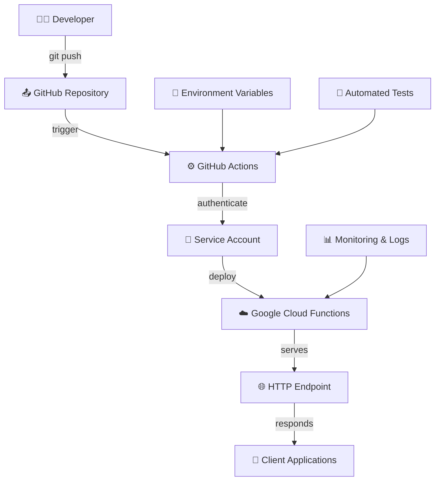

# 🖨️ Simple Message Printer

Un proyecto completo que demuestra cómo implementar CI/CD automático con GitHub Actions y Google Cloud Functions para un servicio simple de impresión de mensajes.

## 📋 Tabla de Contenidos

- [🎯 Objetivo del Proyecto](#-objetivo-del-proyecto)
- [🏗️ Arquitectura](#️-arquitectura)
- [📁 Estructura del Proyecto](#-estructura-del-proyecto)
- [🚀 Quick Start](#-quick-start)
- [🔧 Setup Detallado](#-setup-detallado)
- [💻 Desarrollo Local](#-desarrollo-local)
- [🚀 Deployment](#-deployment)
- [🧪 Testing](#-testing)
- [📊 Monitoreo](#-monitoreo)
- [🔒 Seguridad](#-seguridad)
- [📚 Documentación Técnica](#-documentación-técnica)

## 🎯 Objetivo del Proyecto

Este proyecto fue creado para demostrar cómo implementar un **pipeline completo de CI/CD** usando tecnologías modernas:

### ✅ Lo que hace este proyecto:
- **Funcionalidad Simple**: Imprime mensajes con diferentes formatos
- **CI/CD Automático**: Deployment automático en cada push a GitHub
- **Infraestructura Real**: Usa Google Cloud Functions Gen2
- **Best Practices**: Implementa testing, linting, y documentación completa
- **Template Reutilizable**: Sirve como base para proyectos más complejos

### 🎓 Lo que aprendes implementando esto:
- **GitHub Actions** workflows avanzados
- **Google Cloud Functions** deployment y configuración
- **Service Accounts** y manejo de permisos en GCP
- **Secrets Management** en GitHub
- **Testing automatizado** y quality gates
- **Infraestructura como Código**

## 🏗️ Arquitectura



### 🔄 Flujo de CI/CD

1. **Push a GitHub** → Trigger automático del workflow
2. **Validación** → Tests, linting, y quality checks
3. **Build** → Preparación de archivos para deployment
4. **Deploy** → Creación/actualización de Cloud Function
5. **Testing** → Verificación automática del deployment
6. **Notificación** → Resumen y resultados

## 📁 Estructura del Proyecto

```
CI-CD-simple-message-printer/
├── 📁 .github/workflows/           # GitHub Actions
│   └── deploy-cloud-function.yml   # Pipeline principal
├── 📁 cloud_functions/             # Código para Cloud Functions
│   ├── main.py                     # Entry point
│   └── requirements.txt            # Dependencies
├── 📁 src/                         # Código fuente
│   ├── 📁 printer/                 # Módulo principal
│   │   ├── __init__.py
│   │   ├── message_printer.py      # Lógica de negocio
│   │   └── config.py               # Configuración
│   └── 📁 utils/                   # Utilidades
│       ├── __init__.py
│       └── logger.py               # Logging
├── 📁 scripts/                     # Scripts de automatización
│   ├── setup_ci_cd.sh             # Setup unificado (NUEVO)
│   ├── test_local.sh              # Testing local
│   ├── deploy_manual.sh           # Deploy manual
│   └── check_service_accounts_fixed.sh # Análisis de SAs
├── 📁 tests/                       # Tests unitarios
│   ├── __init__.py
│   └── test_printer.py
├── .gitignore
├── README.md
├── requirements.txt               # Dependencies del proyecto
└── env_example.sh                # Variables de ejemplo
```

## 🚀 Quick Start

### 1️⃣ Crear el Proyecto

```bash
# Clonar o crear el repositorio
git clone <your-repo-url>
cd CI-CD-simple-message-printer

# 🐍 CREAR ENTORNO VIRTUAL (CRÍTICO)
python -m venv venv
source venv/bin/activate  # macOS/Linux
# o venv\Scripts\activate  # Windows

# Verificar entorno virtual activo
which python  # Debe apuntar a venv/
pip install --upgrade pip
pip install -r requirements.txt

# Verificar instalación
python -c "import functions_framework; print('✅ Setup OK')"
```

### 2️⃣ Setup de Google Cloud (NUEVO SCRIPT UNIFICADO)

🎯 **Ahora tienes 3 opciones para configurar Google Cloud:**

#### **Opción A: Modo Interactivo (Recomendado)**
```bash
# Dar permisos de ejecución
chmod +x scripts/setup_ci_cd.sh

# Ejecutar en modo interactivo - te guía paso a paso
./scripts/setup_ci_cd.sh

# El script te preguntará:
# 1. ¿Crear nueva Service Account o usar una existente?
# 2. Si eliges existente, te mostrará las disponibles
# 3. Te ayuda a elegir la mejor opción
```

#### **Opción B: Crear nueva Service Account directamente**
```bash
./scripts/setup_ci_cd.sh --create-new
```

#### **Opción C: Usar Service Account existente**
```bash
# Primero ver qué Service Accounts tienes disponibles
./scripts/check_service_accounts_fixed.sh

# Luego usar una específica
./scripts/setup_ci_cd.sh --use-existing admin-sa@your-project.iam.gserviceaccount.com
```

#### **¿Qué hace el script automáticamente?**
- ✅ **Analiza tu proyecto** → Ve qué Service Accounts ya existen
- ✅ **Evalúa permisos** → Recomienda la mejor Service Account
- ✅ **Habilita APIs** → Configura todas las APIs necesarias
- ✅ **Gestiona permisos** → Asigna roles si crea nueva SA
- ✅ **Genera claves** → Crea JSON para GitHub Secrets
- ✅ **Da instrucciones** → Te dice exactamente qué hacer después

### 3️⃣ Configurar GitHub Secrets

El script de setup te dará **exactamente** qué copiar. Ve a GitHub: `Settings > Secrets and Variables > Actions`

**Secrets REQUERIDOS:**
```
GCP_SA_KEY: {"type":"service_account",...}  # JSON que te da el script
GCP_PROJECT_ID: your-gcp-project-id
```

**Secrets OPCIONALES:**
```
LOG_LEVEL: INFO
DEFAULT_MESSAGE: Hello from Simple Message Printer!
DEFAULT_USER: World
MESSAGE_PREFIX: 🖨️
```

### 4️⃣ Activar CI/CD

```bash
# Push para activar el pipeline
git add .
git commit -m "🚀 Initial setup - Simple Message Printer"
git push origin main

# Ver el deployment en GitHub Actions tab
```

### 5️⃣ Usar la Function (Con Autenticación IAM Requerida)

⚠️ **IMPORTANTE: Esta Cloud Function requiere autenticación IAM**

Tu función está configurada con **autenticación requerida**, lo que significa que solo usuarios autorizados pueden acceder a ella.

#### **👥 Usuarios Autorizados Automáticamente:**
- Service Account del proyecto (para automation)

#### **🔐 Cómo usar la function autenticada:**

```bash
# PASO 1: Autenticarse con Google Cloud
gcloud auth login

# PASO 2: Obtener URL de la function desde GitHub Actions logs o:
FUNCTION_URL=$(gcloud functions describe simple-message-printer-production \
  --region=us-central1 --format="value(serviceConfig.uri)")

# PASO 3: Generar token de autenticación
# Para cuentas de usuario (más común):
ACCESS_TOKEN=$(gcloud auth print-access-token)

# Para Service Accounts (si estás usando una):
# ID_TOKEN=$(gcloud auth print-identity-token --audiences="$FUNCTION_URL")

# PASO 4: Usar la function CON autenticación
curl -X POST "$FUNCTION_URL" \
  -H "Content-Type: application/json" \
  -H "Authorization: Bearer $ACCESS_TOKEN" \
  -d '{"mode": "simple", "message": "Hello World!", "user": "YourName"}'

# PASO 5: Probar diferentes modos (todos requieren autenticación)
curl -X POST "$FUNCTION_URL" \
  -H "Content-Type: application/json" \
  -H "Authorization: Bearer $ACCESS_TOKEN" \
  -d '{"mode": "multiple", "message": "Test", "count": 3, "user": "YourName"}'

curl -X POST "$FUNCTION_URL" \
  -H "Content-Type: application/json" \
  -H "Authorization: Bearer $ACCESS_TOKEN" \
  -d '{"mode": "environment"}'

curl -X POST "$FUNCTION_URL" \
  -H "Content-Type: application/json" \
  -H "Authorization: Bearer $ACCESS_TOKEN" \
  -d '{"mode": "test"}'
```

#### **❌ Sin autenticación FALLARÁ:**
```bash
# Esto dará error 403 Forbidden:
curl -X POST "$FUNCTION_URL" \
  -H "Content-Type: application/json" \
  -d '{"mode": "simple"}'
# Response: {"error": "Forbidden", "status": 403}
```

#### **👥 Agregar usuarios adicionales:**

Si necesitas dar acceso a más usuarios, puedes hacerlo manualmente:

```bash
# Agregar nuevo usuario autorizado
gcloud functions add-iam-policy-binding simple-message-printer-production \
  --region=us-central1 \
  --member="user:nuevo-usuario@empresa.com" \
  --role="roles/cloudfunctions.invoker"

# Agregar grupo de Google Workspace (si aplica)
gcloud functions add-iam-policy-binding simple-message-printer-production \
  --region=us-central1 \
  --member="group:data-team@empresa.com" \
  --role="roles/cloudfunctions.invoker"

# Ver usuarios que tienen acceso actual
gcloud functions get-iam-policy simple-message-printer-production \
  --region=us-central1
```
#### **👥 Gestión de Usuarios Autorizados (Cloud Functions Gen2)**

**Ver usuarios con acceso actual:**
```bash
gcloud functions get-iam-policy simple-message-printer-production \
  --region=us-central1
```

**Agregar nuevo usuario autorizado (Gen2):**
```bash
# Comando específico para Cloud Functions Gen2
gcloud functions add-invoker-policy-binding simple-message-printer-production \
  --region=us-central1 \
  --member="user:nuevo-usuario@empresa.com"
```

**Remover acceso de usuario:**
```bash
gcloud functions remove-invoker-policy-binding simple-message-printer-production \
  --region=us-central1 \
  --member="user:usuario@empresa.com"
```

**Agregar grupo de Google Workspace:**
```bash
gcloud functions add-invoker-policy-binding simple-message-printer-production \
  --region=us-central1 \
  --member="group:data-team@empresa.com"
```

#### **🔧 Troubleshooting de Autenticación:**

**Error: "401 Unauthorized" con Cloud Functions Gen2**
```bash
# Cloud Functions Gen2 requiere permisos específicos
# Usar este comando en lugar de add-iam-policy-binding:
gcloud functions add-invoker-policy-binding FUNCTION_NAME \
  --region=us-central1 \
  --member="user:tu-email@empresa.com"
```

**Error: "Invalid account type for --audiences"**
```bash
# Este error significa que estás usando una cuenta de usuario, no Service Account
# Solución: Usar access token en lugar de identity token
ACCESS_TOKEN=$(gcloud auth print-access-token)
curl -X POST "$FUNCTION_URL" \
  -H "Authorization: Bearer $ACCESS_TOKEN" \
  -H "Content-Type: application/json" \
  -d '{"mode": "test"}'
```

**Error: "Permission denied"**
```bash
# Verificar que tienes permisos correctos para Gen2
gcloud functions get-iam-policy simple-message-printer-production \
  --region=us-central1

# Si no apareces en la lista, agregar permisos:
gcloud functions add-invoker-policy-binding simple-message-printer-production \
  --region=us-central1 \
  --member="user:tu-email@empresa.com"
```

## 🔧 Setup Detallado

### 📋 Prerequisites

- **Google Cloud Account** con billing habilitado
- **GitHub Account** con repositorio
- **gcloud CLI** instalado y autenticado
- **Git** configurado
- **Python 3.11+** instalado

### 🎯 **Opciones de Setup (Nuevo Sistema Unificado)**

El nuevo script `setup_ci_cd.sh` maneja **ambos casos** automáticamente:

#### **📊 Análisis Automático de Service Accounts**

```bash
# Ver análisis detallado de todas las Service Accounts disponibles
./scripts/check_service_accounts_fixed.sh
```

Este script:
- 📋 **Lista todas las SAs** en tu proyecto
- 🔍 **Analiza permisos** de cada una  
- ⭐ **Recomienda** cuáles son mejores para CI/CD
- 📊 **Clasifica** como: PERFECTA, EXCELENTE, BUENA, LIMITADA

#### **🚀 Setup Unificado Inteligente**

```bash
# Modo interactivo - te guía en la decisión
./scripts/setup_ci_cd.sh

# O modos directos:
./scripts/setup_ci_cd.sh --create-new                    # Crear nueva SA
./scripts/setup_ci_cd.sh --use-existing SA_EMAIL        # Usar SA existente
./scripts/setup_ci_cd.sh --help                         # Ver todas las opciones
```

**El script detecta automáticamente:**
- ✅ Si tienes permisos para crear Service Accounts
- ✅ Qué Service Accounts ya existen y sus permisos
- ✅ Cuál es la mejor opción para tu situación
- ✅ Qué APIs están habilitadas/faltan
- ⚠️ Si hay problemas de permisos y cómo solucionarlos

### 🐍 Configuración de Entorno Virtual de Python

**¿Por qué usar un entorno virtual?**
- **Aislamiento**: Evita conflictos entre dependencies de diferentes proyectos
- **Reproducibilidad**: Garantiza que todos usen las mismas versiones
- **Limpieza**: Mantiene tu sistema Python limpio
- **Portabilidad**: Fácil de recrear en otras máquinas

#### 📦 Creación del entorno virtual

**Método 1: venv (recomendado, incluido en Python)**
```bash
# 1. Verificar versión de Python
python --version
# Debe ser 3.11 o superior

# 2. Crear entorno virtual
python -m venv venv
# Esto crea una carpeta 'venv' con el entorno aislado

# 3. Activar entorno virtual
# En Windows:
venv\Scripts\activate

# En macOS/Linux:
source venv/bin/activate

# 4. Verificar activación
# El prompt debe mostrar (venv) al inicio
which python  # macOS/Linux
where python   # Windows
# Debe apuntar a venv/bin/python o venv\Scripts\python.exe

# 5. Actualizar pip en el entorno virtual
python -m pip install --upgrade pip
```

#### 📚 Instalación de dependencies

```bash
# Con entorno virtual activado:

# 1. Instalar dependencies del proyecto
pip install -r requirements.txt

# 2. Verificar instalación
pip list
# Debe mostrar: functions-framework, flask, pytest, flake8

# 3. Para desarrollo local adicional (opcional):
pip install ipython      # REPL mejorado
pip install black        # Code formatter
pip install mypy         # Type checker
```

### 🔧 Instalación de gcloud CLI

Si no tienes gcloud CLI instalado:

**🖥️ Windows:**
```bash
# Descargar desde: https://cloud.google.com/sdk/docs/install-sdk#windows
# O usando winget:
winget install Google.CloudSDK
```

**🍎 macOS:**
```bash
# Usando Homebrew (recomendado):
brew install --cask google-cloud-sdk
```

**🐧 Linux:**
```bash
# Ubuntu/Debian:
sudo snap install google-cloud-cli --classic

# CentOS/RHEL/Fedora:
sudo dnf install google-cloud-cli
```

#### 🔐 Autenticación inicial de gcloud

```bash
# 1. Autenticarse con tu cuenta de Google
gcloud auth login

# 2. Verificar autenticación
gcloud auth list

# 3. Configurar proyecto por defecto
gcloud config set project your-project-id

# 4. Verificar configuración
gcloud config list
```

### 🌍 Configuración de Environments

El proyecto maneja 3 environments automáticamente:

- **`development`**: Feature branches, testing
- **`staging`**: Branch `develop`  
- **`production`**: Branch `main`

Cada environment tiene su propia Cloud Function:
- `simple-message-printer-development`
- `simple-message-printer-staging`
- `simple-message-printer-production`

## 💻 Desarrollo Local

### 🧪 Testing Local

```bash
# ⚠️ IMPORTANTE: Siempre con entorno virtual activado
source venv/bin/activate  # Si no está activado

# Ejecutar tests unitarios
pytest tests/ -v

# Testing de la function localmente
./scripts/test_local.sh
# Abre http://localhost:8080
```

### 🔄 Desarrollo Iterativo

```bash
# Workflow típico de desarrollo:

# 1. Activar entorno virtual (si no está activo)
source venv/bin/activate

# 2. Hacer cambios en src/
code src/printer/message_printer.py  # O tu editor favorito

# 3. Probar cambios localmente
./scripts/test_local.sh

# 4. Ejecutar tests
pytest tests/ -v

# 5. Verificar calidad de código
flake8 src/ --count --select=E9,F63,F7,F82 --show-source --statistics

# 6. Si todo pasa, commit y push
git add .
git commit -m "✨ Add new functionality"
git push origin feature/new-functionality

# 7. Automáticamente deploya a development environment
```

## 🚀 Deployment

### 🤖 Deployment Automático (Recomendado)

El deployment se hace automáticamente via GitHub Actions:

1. **Push a cualquier branch** → deploya a `development`
2. **Push a `develop`** → deploya a `staging`  
3. **Push a `main`** → deploya a `production`
4. **Manual trigger** → permite elegir environment

### 📊 Monitoring del Deployment

```bash
# Ver logs de GitHub Actions
# GitHub repo → Actions tab

# Ver logs de Cloud Function
gcloud functions logs read simple-message-printer-production \
  --region=us-central1 \
  --limit=50

# Metrics en GCP Console
# Cloud Functions → simple-message-printer-production → Metrics
```

## 🧪 Testing

### 🔬 Tests Unitarios

```bash
# Ejecutar todos los tests
pytest tests/ -v

# Con coverage
pytest tests/ --cov=src --cov-report=html

# Tests específicos
pytest tests/test_printer.py::TestMessagePrinter::test_print_message_basic -v
```

### 🌐 Tests de Integration

```bash
# Test de la function deployada
FUNCTION_URL="your-function-url"

# Test básico
curl -X POST "$FUNCTION_URL" \
  -H "Content-Type: application/json" \
  -d '{"mode": "test"}'

# Test de múltiples mensajes  
curl -X POST "$FUNCTION_URL" \
  -H "Content-Type: application/json" \
  -d '{"mode": "multiple", "message": "Integration test", "count": 3}'

# Test de environment info
curl -X POST "$FUNCTION_URL" \
  -H "Content-Type: application/json" \
  -d '{"mode": "environment"}'
```

## 📊 Monitoreo

### 📋 Logs

```bash
# Cloud Function logs
gcloud functions logs read simple-message-printer-production --region=us-central1

# Logs en tiempo real
gcloud functions logs tail simple-message-printer-production --region=us-central1

# Filtrar por severity
gcloud functions logs read simple-message-printer-production \
  --region=us-central1 \
  --filter="severity>=ERROR"
```

### 📈 Metrics

**En GCP Console:**
- Cloud Functions → tu function → Metrics tab
- Monitoring → Dashboards → crear dashboard custom

**Metrics importantes:**
- Invocations per second
- Execution time
- Memory utilization  
- Error rate

## 🔒 Seguridad

### 🌐 Configuración Actual: Function Pública

**Estado actual:** La Cloud Function está configurada como **pública** (`--allow-unauthenticated`)

**Esto significa:**
- ✅ **Fácil de usar** → No necesita tokens de autenticación
- ✅ **Testing simple** → Cualquier curl funciona
- ⚠️ **Menos seguro** → Cualquiera con la URL puede usarla
- 💡 **Ideal para desarrollo** y demos

### 🔐 Para Habilitar Autenticación (Opcional)

Si quieres hacer la function privada, modifica el workflow:

```yaml
# En .github/workflows/deploy-cloud-function.yml
# Cambiar esta línea:
--allow-unauthenticated

# Por esta:
--no-allow-unauthenticated
```

**Entonces necesitarás autenticación:**
```bash
# Generar token
FUNCTION_URL="your-function-url"
ID_TOKEN=$(gcloud auth print-identity-token --audiences="$FUNCTION_URL")

# Usar con autenticación
curl -X POST "$FUNCTION_URL" \
  -H "Authorization: Bearer $ID_TOKEN" \
  -H "Content-Type: application/json" \
  -d '{"mode": "simple", "message": "Hello World!", "user": "YourName"}'
```

### 🛡️ Permisos IAM del Service Account

El Service Account tiene **solo** los permisos necesarios:
- `cloudfunctions.admin` - Para deploy de functions
- `cloudbuild.builds.builder` - Para builds
- `logging.admin` - Para logs
- `iam.serviceAccountUser` - Para usar Service Accounts
- `serviceusage.serviceUsageAdmin` - Para gestionar APIs

## 📚 Documentación Técnica

### 🎛️ API Reference

#### POST / (Main endpoint)

**Request Body:**
```json
{
  "mode": "simple|multiple|environment|test",
  "message": "string (optional)",
  "user": "string (optional)",
  "count": "number (optional, max 10)"
}
```

**Modes:**

1. **`simple`** - Un mensaje simple
```json
{"mode": "simple", "message": "Hello!", "user": "Alice"}
```

2. **`multiple`** - Múltiples mensajes numerados
```json
{"mode": "multiple", "message": "Test", "count": 3, "user": "Bob"}
```

3. **`environment`** - Info del entorno de deployment
```json
{"mode": "environment"}
```

4. **`test`** - Health check y validación
```json
{"mode": "test"}
```

**Response:**
```json
{
  "success": true,
  "mode": "simple",
  "results": ["🖨️ [2024-01-15 10:30:00] [PRODUCTION] Hello! - from Alice"],
  "messages_printed": 1,
  "timestamp": "2024-01-15T10:30:00.123Z",
  "environment": "production",
  "function_version": "1.0.0"
}
```

### 🔧 Variables de Entorno

| Variable | Default | Descripción |
|----------|---------|-------------|
| `LOG_LEVEL` | `INFO` | Nivel de logging |
| `ENVIRONMENT` | `development` | Environment actual |
| `DEFAULT_MESSAGE` | `Hello from Simple Message Printer!` | Mensaje por defecto |
| `DEFAULT_USER` | `World` | Usuario por defecto |
| `MESSAGE_PREFIX` | `🖨️` | Prefijo de mensajes |
| `MAX_MESSAGE_LENGTH` | `1000` | Límite de caracteres |
| `MAX_MESSAGES_PER_REQUEST` | `10` | Límite de mensajes por request |

### 🐛 Troubleshooting

#### ❌ Common Issues

**1. Setup script no encuentra Service Accounts**
```bash
# Verificar autenticación y proyecto
gcloud auth list
gcloud config get-value project

# Re-ejecutar análisis
./scripts/check_service_accounts_fixed.sh
```

**2. Deploy falla con "Permission Denied"**
```bash
# Verificar que la Service Account tiene permisos
./scripts/setup_ci_cd.sh --help

# Re-ejecutar setup para verificar/reparar permisos
./scripts/setup_ci_cd.sh
```

**3. Function retorna 500 Error**
```bash
# Ver logs detallados
gcloud functions logs read simple-message-printer-production --region=us-central1 --limit=10

# Verificar imports
pytest tests/ -v
```

**4. GitHub Actions falla en deploy**
```bash
# Verificar secrets en GitHub
# Settings → Secrets → Actions
# Debe tener: GCP_SA_KEY, GCP_PROJECT_ID
```

**5. Local testing no funciona**
```bash
# Verificar entorno virtual
source venv/bin/activate

# Verificar estructura
ls -la cloud_functions/
# Debe tener: main.py, printer/, utils/

# Re-ejecutar setup local
./scripts/test_local.sh
```

### 🆘 Support

Si encuentras issues:

1. **Verificar configuración** con el script unificado:
   ```bash
   ./scripts/setup_ci_cd.sh --help
   ./scripts/check_service_accounts_fixed.sh
   ```

2. **Revisar logs** en GCP Console y GitHub Actions

3. **Ejecutar tests** localmente:
   ```bash
   pytest tests/ -v
   ./scripts/test_local.sh
   ```

4. **Re-ejecutar setup** si es necesario:
   ```bash
   ./scripts/setup_ci_cd.sh
   ```

---

## 🎉 Conclusión

Este proyecto demuestra un **pipeline completo de CI/CD moderno** con:

✅ **Setup Inteligente** → Script unificado que analiza y recomienda  
✅ **Deployment automático** en cada push  
✅ **Testing automatizado** con quality gates  
✅ **Infraestructura real** en Google Cloud  
✅ **Security best practices** con Service Accounts  
✅ **Monitoring y logging** completo  
✅ **Documentación exhaustiva**  

### 🔧 **Personalización:**

Este proyecto sirve como **template base** - puedes reemplazar la lógica de "message printing" con cualquier funcionalidad que necesites, manteniendo toda la infraestructura de CI/CD intacta.

### 🚀 **Siguientes Pasos:**

1. **Ejecuta** `./scripts/setup_ci_cd.sh` para comenzar
2. **Personaliza** la lógica en `src/printer/message_printer.py`
3. **Agrega** tus propios tests en `tests/`
4. **Deploya** con confianza usando `git push`

---

*Creado como demostración de CI/CD moderno con GitHub Actions y Google Cloud Functions* 🚀