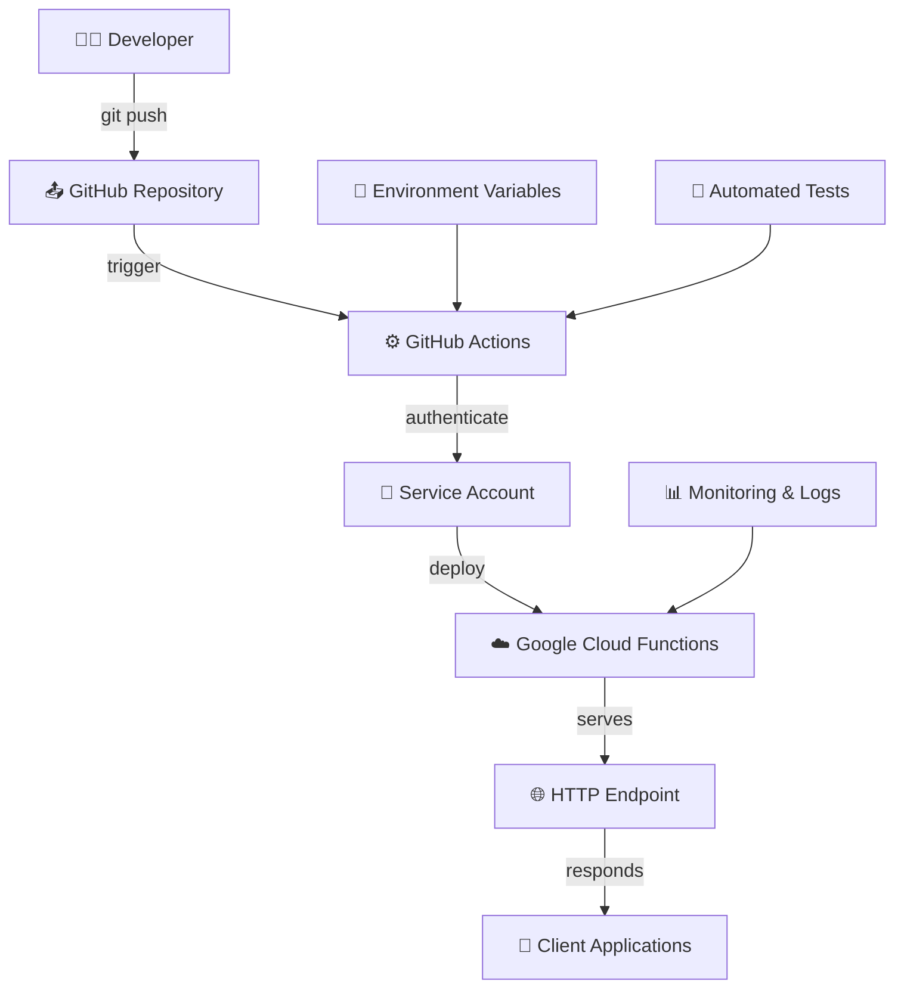

# 🖨️ Simple Message Printer

Un proyecto completo que demuestra cómo implementar CI/CD automático con GitHub Actions y Google Cloud Functions para un servicio simple de impresión de mensajes.

## 📋 Tabla de Contenidos

- [🎯 Objetivo del Proyecto](#-objetivo-del-proyecto)
- [🏗️ Arquitectura](#️-arquitectura)
- [📁 Estructura del Proyecto](#-estructura-del-proyecto)
- [🚀 Quick Start](#-quick-start)
- [🔧 Setup Detallado](#-setup-detallado)
- [💻 Desarrollo Local](#-desarrollo-local)
- [🚀 Deployment](#-deployment)
- [🧪 Testing](#-testing)
- [📊 Monitoreo](#-monitoreo)
- [🔒 Seguridad](#-seguridad)
- [📚 Documentación Técnica](#-documentación-técnica)

## 🎯 Objetivo del Proyecto

Este proyecto fue creado para demostrar cómo implementar un **pipeline completo de CI/CD** usando tecnologías modernas:

### ✅ Lo que hace este proyecto:
- **Funcionalidad Simple**: Imprime mensajes con diferentes formatos
- **CI/CD Automático**: Deployment automático en cada push a GitHub
- **Infraestructura Real**: Usa Google Cloud Functions Gen2
- **Best Practices**: Implementa testing, linting, y documentación completa
- **Template Reutilizable**: Sirve como base para proyectos más complejos

### 🎓 Lo que aprendes implementando esto:
- **GitHub Actions** workflows avanzados
- **Google Cloud Functions** deployment y configuración
- **Service Accounts** y manejo de permisos en GCP
- **Secrets Management** en GitHub
- **Testing automatizado** y quality gates
- **Infraestructura como Código**

## 🏗️ Arquitectura



### 🔄 Flujo de CI/CD

1. **Push a GitHub** → Trigger automático del workflow
2. **Validación** → Tests, linting, y quality checks
3. **Build** → Preparación de archivos para deployment
4. **Deploy** → Creación/actualización de Cloud Function
5. **Testing** → Verificación automática del deployment
6. **Notificación** → Resumen y resultados

## 📁 Estructura del Proyecto

```
CI-CD-simple-message-printer/
├── 📁 .github/workflows/           # GitHub Actions
│   └── deploy-cloud-function.yml   # Pipeline principal
├── 📁 cloud_functions/             # Código para Cloud Functions
│   ├── main.py                     # Entry point
│   └── requirements.txt            # Dependencies
├── 📁 src/                         # Código fuente
│   ├── 📁 printer/                 # Módulo principal
│   │   ├── __init__.py
│   │   ├── message_printer.py      # Lógica de negocio
│   │   └── config.py               # Configuración
│   └── 📁 utils/                   # Utilidades
│       ├── __init__.py
│       └── logger.py               # Logging
├── 📁 scripts/                     # Scripts de automatización
│   ├── setup_cloud_deployment.sh   # Setup inicial
│   ├── test_local.sh              # Testing local
│   └── deploy_manual.sh           # Deploy manual
├── 📁 tests/                       # Tests unitarios
│   ├── __init__.py
│   └── test_printer.py
├── .gitignore
├── README.md
├── requirements.txt               # Dependencies del proyecto
└── env_example.sh                # Variables de ejemplo
```

## 🚀 Quick Start

### 1️⃣ Crear el Proyecto

```bash
# Clonar o crear el repositorio
git clone <your-repo-url>
cd CI-CD-simple-message-printer

# 🐍 CREAR ENTORNO VIRTUAL (CRÍTICO)
python -m venv venv
source venv/bin/activate  # macOS/Linux
# o venv\Scripts\activate  # Windows

# Verificar entorno virtual activo
which python  # Debe apuntar a venv/
pip install --upgrade pip
pip install -r requirements.txt

# Verificar instalación
python -c "import functions_framework; print('✅ Setup OK')"
```

### 2️⃣ Setup de Google Cloud

```bash
# Dar permisos de ejecución
chmod +x scripts/setup_cloud_deployment.sh

# Ejecutar setup automático
./scripts/setup_cloud_deployment.sh --project-id your-gcp-project-id

# Esto configurará:
# ✅ APIs necesarias
# ✅ Service Account
# ✅ Permisos IAM
# ✅ Scripts de testing
```

### 3️⃣ Configurar GitHub Secrets

En GitHub: `Settings > Secrets and Variables > Actions`

**Secrets REQUERIDOS:**
```
GCP_SA_KEY: {"type":"service_account",...}  # JSON del Service Account
GCP_PROJECT_ID: your-gcp-project-id
```

**Secrets OPCIONALES:**
```
LOG_LEVEL: INFO
DEFAULT_MESSAGE: Hello from Simple Message Printer!
DEFAULT_USER: World
MESSAGE_PREFIX: 🖨️
```

### 4️⃣ Activar CI/CD

```bash
# Push para activar el pipeline
git add .
git commit -m "🚀 Initial setup - Simple Message Printer"
git push origin main

# Ver el deployment en GitHub Actions tab
```

### 5️⃣ Usar la Function (Con Autenticación Requerida)

⚠️ **IMPORTANTE: Esta Cloud Function requiere autenticación IAM**

```bash
# PASO 1: Autenticarse con Google Cloud
gcloud auth login

# PASO 2: Obtener URL de la function desde GitHub Actions logs o:
FUNCTION_URL=$(gcloud functions describe your-existing-GC-function \
  --region=us-central1 --format="value(serviceConfig.uri)")

# PASO 3: Generar token de autenticación
ID_TOKEN=$(gcloud auth print-identity-token --audiences="$FUNCTION_URL")

# PASO 4: Usar la function CON autenticación
curl -X POST "$FUNCTION_URL" \
  -H "Content-Type: application/json" \
  -H "Authorization: Bearer $ID_TOKEN" \
  -d '{"mode": "simple", "message": "Hello World!", "user": "YourName"}'

# ❌ Esto FALLARÁ (sin autenticación):
curl -X POST "$FUNCTION_URL" \
  -H "Content-Type: application/json" \
  -d '{"mode": "simple"}'
# Response: 403 Forbidden
```

## 🔧 Setup Detallado

### 📋 Prerequisites

- **Google Cloud Account** con billing habilitado
- **GitHub Account** con repositorio
- **gcloud CLI** instalado y autenticado
- **Git** configurado
- **Python 3.11+** instalado

#### 🐍 Configuración de Entorno Virtual de Python

**¿Por qué usar un entorno virtual?**
- **Aislamiento**: Evita conflictos entre dependencies de diferentes proyectos
- **Reproducibilidad**: Garantiza que todos usen las mismas versiones
- **Limpieza**: Mantiene tu sistema Python limpio
- **Portabilidad**: Fácil de recrear en otras máquinas

#### 📦 Creación del entorno virtual

**Método 1: venv (recomendado, incluido en Python)**
```bash
# 1. Verificar versión de Python
python --version
# Debe ser 3.11 o superior

# 2. Crear entorno virtual
python -m venv venv
# Esto crea una carpeta 'venv' con el entorno aislado

# 3. Activar entorno virtual
# En Windows:
venv\Scripts\activate

# En macOS/Linux:
source venv/bin/activate

# 4. Verificar activación
# El prompt debe mostrar (venv) al inicio
which python  # macOS/Linux
where python   # Windows
# Debe apuntar a venv/bin/python o venv\Scripts\python.exe

# 5. Actualizar pip en el entorno virtual
python -m pip install --upgrade pip
```

**Método 2: conda (si prefieres Anaconda/Miniconda)**
```bash
# 1. Crear entorno con Python 3.11
conda create -n simple-printer python=3.11

# 2. Activar entorno
conda activate simple-printer

# 3. Verificar activación
which python    # Debe apuntar a conda envs
python --version # Debe ser 3.11.x
```

#### 📚 Instalación de dependencies

```bash
# Con entorno virtual activado:

# 1. Instalar dependencies del proyecto
pip install -r requirements.txt

# 2. Verificar instalación
pip list
# Debe mostrar: functions-framework, flask, pytest, flake8

# 3. Para desarrollo local adicional (opcional):
pip install ipython      # REPL mejorado
pip install black        # Code formatter
pip install mypy         # Type checker
```

#### 🔄 Workflow diario de desarrollo

```bash
# Cada vez que trabajes en el proyecto:

# 1. Navegar al directorio del proyecto
cd CI-CD-simple-message-printer

# 2. Activar entorno virtual
source venv/bin/activate  # macOS/Linux
# o
venv\Scripts\activate     # Windows

# 3. Verificar que está activado
# Debe ver (venv) en el prompt

# 4. Trabajar en el proyecto...
python src/printer/message_printer.py
pytest tests/
./scripts/test_local.sh

# 5. Desactivar cuando termines
deactivate
```

#### 🗂️ Estructura con entorno virtual

```
CI-CD-simple-message-printer/
├── venv/                    # ← Entorno virtual (en .gitignore)
│   ├── bin/                 # Scripts (macOS/Linux)
│   ├── Scripts/             # Scripts (Windows)
│   ├── lib/                 # Libraries instaladas
│   └── pyvenv.cfg          # Configuración del entorno
├── .github/workflows/
├── src/
├── tests/
├── requirements.txt         # Dependencies del proyecto
└── .gitignore              # venv/ debe estar aquí
```

#### ⚠️ Importante: .gitignore

Asegúrate de que `venv/` esté en `.gitignore`:

```bash
# Verificar que venv está ignorado
cat .gitignore | grep venv

# Si no está, agregarlo:
echo "venv/" >> .gitignore
echo ".venv/" >> .gitignore  # También común
```

#### 🔧 Comandos útiles

```bash
# Ver qué packages están instalados
pip list

# Ver información del entorno
pip show functions-framework

# Generar requirements.txt actualizado
pip freeze > requirements-current.txt

# Comparar con requirements.txt original
diff requirements.txt requirements-current.txt

# Reinstalar todo desde requirements.txt
pip install -r requirements.txt --force-reinstall

# Desinstalar todo (limpiar entorno)
pip freeze | xargs pip uninstall -y
```

#### 🐛 Troubleshooting común

**Problema: `python` comando no encontrado**
```bash
# Verificar instalación de Python
python3 --version  # En algunos sistemas es python3
# O
py --version       # En Windows con Python Launcher
```

**Problema: Entorno no se activa**
```bash
# En Windows, si PowerShell no permite scripts:
Set-ExecutionPolicy -ExecutionPolicy RemoteSigned -Scope CurrentUser

# Alternativa en Windows:
venv\Scripts\activate.bat  # En lugar de activate.ps1
```

**Problema: Dependencies no se instalan**
```bash
# Verificar que pip está actualizado
python -m pip install --upgrade pip

# Verificar que estás en el entorno virtual
which pip  # Debe apuntar a venv/bin/pip

# Instalar con verbose para ver errores
pip install -r requirements.txt -v
```

**Problema: Import errors en tests**
```bash
# Verificar que estás en el directorio correcto
pwd  # Debe ser simple-message-printer/

# Verificar que src/ está en el path
python -c "import sys; print(sys.path)"

# Ejecutar tests desde el directorio raíz
pytest tests/ -v
```

#### 🔧 Instalación de gcloud CLI

Si no tienes gcloud CLI instalado:

**🖥️ Windows:**
```bash
# Descargar e instalar desde:
# https://cloud.google.com/sdk/docs/install-sdk#windows

# O usando Chocolatey:
choco install gcloudsdk

# O usando winget:
winget install Google.CloudSDK
```

**🍎 macOS:**
```bash
# Usando Homebrew (recomendado):
brew install --cask google-cloud-sdk

# O descargar desde:
# https://cloud.google.com/sdk/docs/install-sdk#mac
```

**🐧 Linux (Ubuntu/Debian):**
```bash
# Método 1: Snap (más fácil)
sudo snap install google-cloud-cli --classic

# Método 2: APT repository
echo "deb [signed-by=/usr/share/keyrings/cloud.google.gpg] https://packages.cloud.google.com/apt cloud-sdk main" | sudo tee -a /etc/apt/sources.list.d/google-cloud-sdk.list
curl https://packages.cloud.google.com/apt/doc/apt-key.gpg | sudo apt-key --keyring /usr/share/keyrings/cloud.google.gpg add -
sudo apt-get update && sudo apt-get install google-cloud-cli
```

**🐧 Linux (CentOS/RHEL/Fedora):**
```bash
# Añadir repositorio YUM
sudo tee -a /etc/yum.repos.d/google-cloud-sdk.repo << EOM
[google-cloud-cli]
name=Google Cloud CLI
baseurl=https://packages.cloud.google.com/yum/repos/cloud-sdk-el8-x86_64
enabled=1
gpgcheck=1
repo_gpgcheck=0
gpgkey=https://packages.cloud.google.com/yum/doc/yum-key.gpg
       https://packages.cloud.google.com/yum/doc/rpm-package-key.gpg
EOM

# Instalar
sudo dnf install google-cloud-cli
# O en sistemas más antiguos: sudo yum install google-cloud-cli
```

#### 🔐 Autenticación inicial de gcloud

Después de instalar gcloud CLI:

```bash
# 1. Autenticarse con tu cuenta de Google
gcloud auth login
# Esto abrirá un browser para que autorices el acceso

# 2. Verificar autenticación
gcloud auth list
# Debe mostrar tu email con un asterisco (*)

# 3. Configurar proyecto por defecto (opcional)
gcloud config set project your-project-id

# 4. Verificar configuración
gcloud config list

# 5. Habilitar Application Default Credentials (recomendado)
gcloud auth application-default login
```

#### ✅ Verificación de setup

```bash
# Verificar instalación
gcloud version

# Verificar autenticación
gcloud auth list --filter=status:ACTIVE --format="value(account)"

# Test básico
gcloud projects list --limit=5
```

### 🔐 Google Cloud Setup

1. **Crear o seleccionar proyecto GCP:**
```bash
# Crear nuevo proyecto
gcloud projects create your-simple-printer-project --name="Simple Message Printer"

# O usar proyecto existente
gcloud config set project your-existing-project
```

2. **Ejecutar setup automático:**
```bash
./scripts/setup_cloud_deployment.sh --project-id your-project-id
```

3. **Verificar setup:**
```bash
# Verificar APIs habilitadas
gcloud services list --enabled --filter="name:(cloudfunctions OR cloudbuild)"

# Verificar Service Account
gcloud iam service-accounts list --filter="github-actions-deployer"
```

### 🔑 GitHub Secrets Setup

El script de setup te dará el JSON del Service Account. Copiarlo en GitHub:

1. Ve a tu repo → `Settings` → `Secrets and Variables` → `Actions`
2. Click `New repository secret`
3. Agregar cada secret según la lista de arriba

### 🌍 Configuración de Environments

El proyecto maneja 3 environments automáticamente:

- **`development`**: Feature branches, testing
- **`staging`**: Branch `develop`  
- **`production`**: Branch `main`

Cada environment tiene su propia Cloud Function:
- `simple-message-printer-development`
- `simple-message-printer-staging`
- `simple-message-printer-production`

## 💻 Desarrollo Local

### 🐍 Setup inicial del entorno

```bash
# 1. Clonar el repositorio
git clone https://github.com/Flor243/CI-CD-simple-message-printer.git
cd CI-CD-simple-message-printer

# 2. Crear y activar entorno virtual
python -m venv venv
source venv/bin/activate  # macOS/Linux
# o venv\Scripts\activate  # Windows

# 3. Verificar entorno virtual activo
# Debe ver (venv) en el prompt
which python  # Debe apuntar a venv/

# 4. Instalar dependencies
pip install --upgrade pip
pip install -r requirements.txt

# 5. Verificar instalación
python -c "import functions_framework; print('✅ Functions Framework OK')"
python -c "import pytest; print('✅ Pytest OK')"
```

### 🧪 Testing Local

```bash
# ⚠️ IMPORTANTE: Siempre con entorno virtual activado
source venv/bin/activate  # Si no está activado

# Setup de variables de entorno
source env_example.sh

# Ejecutar tests unitarios
pytest tests/ -v

# Testing de la function localmente
./scripts/test_local.sh
# Abre http://localhost:8080
```

### 🔄 Desarrollo Iterativo

```bash
# Workflow típico de desarrollo:

# 1. Activar entorno virtual (si no está activo)
source venv/bin/activate

# 2. Hacer cambios en src/
code src/printer/message_printer.py  # O tu editor favorito

# 3. Probar cambios localmente
./scripts/test_local.sh

# 4. Ejecutar tests
pytest tests/ -v

# 5. Verificar calidad de código
flake8 src/ --count --select=E9,F63,F7,F82 --show-source --statistics

# 6. Si todo pasa, commit y push
git add .
git commit -m "✨ Add new functionality"
git push origin feature/new-functionality

# 7. Automáticamente deploya a development environment
```

### 📝 Agregar Nueva Funcionalidad

Ejemplo: Agregar modo "countdown"

```python
# En src/printer/message_printer.py
def print_countdown(self, start: int, user: str = None) -> list:
    """Imprime countdown desde start hasta 0"""
    results = []
    for i in range(start, -1, -1):
        message = f"Countdown: {i}"
        result = self.print_message(message, user)
        results.append(result)
    return results
```

```python
# En cloud_functions/main.py, agregar en el request handler:
elif mode == 'countdown':
    start_num = min(request_json.get('start', 5), 10)  # Max 10
    results = printer.print_countdown(start_num, user)
    logger.info(f"🔢 Countdown from {start_num} completed")
```

## 🚀 Deployment

### 🤖 Deployment Automático (Recomendado)

El deployment se hace automáticamente via GitHub Actions:

1. **Push a cualquier branch** → deploya a `development`
2. **Push a `develop`** → deploya a `staging`  
3. **Push a `main`** → deploya a `production`
4. **Manual trigger** → permite elegir environment

### 📊 Monitoring del Deployment

```bash
# Ver logs de GitHub Actions
# GitHub repo → Actions tab

# Ver logs de Cloud Function
gcloud functions logs read your-existing-GC-function \
  --region=us-central1 \
  --limit=50

# Metrics en GCP Console
# Cloud Functions → your-existing-GC-function → Metrics
```

### 🔧 Deploy Manual (Backup)

```bash
# Si GitHub Actions falla o para testing rápido
./scripts/deploy_manual.sh

# Para deploy a environment específico
gcloud functions deploy simple-message-printer-manual \
  --gen2 \
  --runtime=python311 \
  --source=cloud_functions/ \
  --entry-point=simple_message_printer \
  --trigger-http \
  --allow-unauthenticated \
  --region=us-central1
```

## 🧪 Testing

### 🔬 Tests Unitarios

```bash
# Ejecutar todos los tests
pytest tests/ -v

# Con coverage
pytest tests/ --cov=src --cov-report=html

# Tests específicos
pytest tests/test_printer.py::TestMessagePrinter::test_print_message_basic -v
```

### 🌐 Tests de Integration

```bash
# Test de la function deployada
FUNCTION_URL="your-function-url"

# Test básico
curl -X POST "$FUNCTION_URL" \
  -H "Content-Type: application/json" \
  -d '{"mode": "test"}'

# Test de múltiples mensajes  
curl -X POST "$FUNCTION_URL" \
  -H "Content-Type: application/json" \
  -d '{"mode": "multiple", "message": "Integration test", "count": 3}'

# Test de environment info
curl -X POST "$FUNCTION_URL" \
  -H "Content-Type: application/json" \
  -d '{"mode": "environment"}'
```

### 📈 Load Testing (Opcional)

```bash
# Usando Apache Bench
ab -n 100 -c 10 -T 'application/json' \
  -p test_payload.json \
  "$FUNCTION_URL"

# test_payload.json:
# {"mode": "simple", "message": "Load test", "user": "LoadTester"}
```

## 📊 Monitoreo

### 📊 Monitoreo

### 📋 Logs

```bash
# Cloud Function logs (usuarios autenticados)
gcloud functions logs read your-existing-GC-function --region=us-central1

# Logs en tiempo real
gcloud functions logs tail your-existing-GC-function --region=us-central1

# Filtrar por severity
gcloud functions logs read your-existing-GC-function \
  --region=us-central1 \
  --filter="severity>=ERROR"

# Ver logs de accesos denegados (security monitoring)
gcloud functions logs read your-existing-GC-function \
  --region=us-central1 \
  --filter="textPayload:403 OR textPayload:Forbidden"
```

### 📈 Metrics

**En GCP Console:**
- Cloud Functions → tu function → Metrics tab
- Monitoring → Dashboards → crear dashboard custom

**Metrics importantes:**
- Invocations per second
- Execution time
- Memory utilization  
- Error rate

### 🚨 Alerting (Opcional)

```bash
# Crear alerta para error rate
gcloud alpha monitoring policies create \
  --policy-from-file=alerting-policy.yaml
```

## 🔒 Seguridad

### 🔐 Autenticación IAM

**✅ IMPLEMENTADO: Esta Cloud Function requiere autenticación**

- **Solo usuarios autorizados** pueden invocar la function
- **Tokens IAM requeridos** para cada request
- **Configuración automática** de permisos durante deployment
- **Monitoring de accesos** denegados

#### 👥 Gestión de Usuarios Autorizados

```bash
# Ver usuarios que tienen acceso actual
gcloud functions get-iam-policy your-existing-GC-function \
  --region=us-central1

# Agregar nuevo usuario autorizado
gcloud functions add-iam-policy-binding your-existing-GC-function \
  --region=us-central1 \
  --member="user:nuevo-usuario@empresa.com" \
  --role="roles/cloudfunctions.invoker"

# Remover acceso de usuario
gcloud functions remove-iam-policy-binding your-existing-GC-function \
  --region=us-central1 \
  --member="user:usuario@empresa.com" \
  --role="roles/cloudfunctions.invoker"

# Agregar grupo de Google Workspace (si aplica)
gcloud functions add-iam-policy-binding your-existing-GC-function \
  --region=us-central1 \
  --member="group:data-team@empresa.com" \
  --role="roles/cloudfunctions.invoker"
```

#### 🔍 Testing de Seguridad

```bash
# Test que autenticación funciona
FUNCTION_URL="your-function-url"
ID_TOKEN=$(gcloud auth print-identity-token --audiences="$FUNCTION_URL")

# Request autenticado (debe funcionar)
curl -X POST "$FUNCTION_URL" \
  -H "Authorization: Bearer $ID_TOKEN" \
  -H "Content-Type: application/json" \
  -d '{"mode": "test"}'

# Request sin autenticación (debe fallar con 403)
curl -X POST "$FUNCTION_URL" \
  -H "Content-Type: application/json" \
  -d '{"mode": "test"}'
```

### 🛡️ Permisos IAM

El Service Account tiene **solo** los permisos necesarios:
- `cloudfunctions.admin` - Para deploy de functions
- `cloudbuild.builds.builder` - Para builds
- `logging.admin` - Para logs
- `serviceusage.serviceUsageAdmin` - Para gestionar APIs

### 🔍 Audit Logs

```bash
# Ver audit logs de IAM
gcloud logging read 'protoPayload.serviceName="cloudresourcemanager.googleapis.com"' \
  --limit=50

# Ver accesos a la function
gcloud logging read 'resource.type="cloud_function"' \
  --filter='protoPayload.methodName="google.cloud.functions.v1.CloudFunctionsService.CallFunction"'
```

## 📚 Documentación Técnica

### 🎛️ API Reference

#### POST / (Main endpoint)

**Request Body:**
```json
{
  "mode": "simple|multiple|environment|test",
  "message": "string (optional)",
  "user": "string (optional)",
  "count": "number (optional, max 10)"
}
```

**Modes:**

1. **`simple`** - Un mensaje simple
```json
{"mode": "simple", "message": "Hello!", "user": "Alice"}
```

2. **`multiple`** - Múltiples mensajes numerados
```json
{"mode": "multiple", "message": "Test", "count": 3, "user": "Bob"}
```

3. **`environment`** - Info del entorno de deployment
```json
{"mode": "environment"}
```

4. **`test`** - Health check y validación
```json
{"mode": "test"}
```

**Response:**
```json
{
  "success": true,
  "mode": "simple",
  "results": ["🖨️ [2024-01-15 10:30:00] [PRODUCTION] Hello! - from Alice"],
  "messages_printed": 1,
  "timestamp": "2024-01-15T10:30:00.123Z",
  "environment": "production",
  "function_version": "1.0.0"
}
```

### 🔧 Variables de Entorno

| Variable | Default | Descripción |
|----------|---------|-------------|
| `LOG_LEVEL` | `INFO` | Nivel de logging |
| `ENVIRONMENT` | `development` | Environment actual |
| `DEFAULT_MESSAGE` | `Hello from Simple Message Printer!` | Mensaje por defecto |
| `DEFAULT_USER` | `World` | Usuario por defecto |
| `MESSAGE_PREFIX` | `🖨️` | Prefijo de mensajes |
| `MAX_MESSAGE_LENGTH` | `1000` | Límite de caracteres |
| `MAX_MESSAGES_PER_REQUEST` | `10` | Límite de mensajes por request |

### 🏗️ Arquitectura del Código

```python
# Estructura modular
src/
├── printer/              # Lógica de negocio
│   ├── message_printer.py    # Clase principal
│   └── config.py             # Configuración centralizada
└── utils/                # Utilidades
    └── logger.py             # Logging estructurado

cloud_functions/
└── main.py               # Entry point para Cloud Functions
```

### 🔄 Flujo de Request

1. **HTTP Request** → `main.py:simple_message_printer()`
2. **Parse Request** → Extrae parámetros del JSON
3. **Initialize** → Crea instancia de `MessagePrinter`
4. **Process** → Ejecuta según el `mode` especificado
5. **Response** → Retorna JSON con resultados

### 🐛 Troubleshooting

#### ❌ Common Issues

**1. Deploy falla con "Permission Denied"**
```bash
# Verificar Service Account
gcloud iam service-accounts list --filter="github-actions-deployer"

# Re-ejecutar setup
./scripts/setup_cloud_deployment.sh --project-id your-project
```

**2. Function retorna 500 Error**
```bash
# Ver logs detallados
gcloud functions logs read simple-message-printer-production --region=us-central1 --limit=10

# Verificar imports
pytest tests/ -v
```

**3. GitHub Actions falla en deploy**
```bash
# Verificar secrets en GitHub
# Settings → Secrets → Actions
# Debe tener: GCP_SA_KEY, GCP_PROJECT_ID
```

**4. Local testing no funciona**
```bash
# Verificar estructura
ls -la cloud_functions/
# Debe tener: main.py, printer/, utils/

# Re-ejecutar setup
./scripts/test_local.sh
```

### Support

Si encuentras issues:

1. **Verificar logs** en GCP Console
2. **Revisar GitHub Actions** logs
3. **Ejecutar tests** localmente
4. **Verificar permisos** del Service Account
5. **Re-ejecutar setup** si es necesario

---

## Conclusión

Este proyecto demuestra un **pipeline completo de CI/CD moderno** con:

✅ **Deployment automático** en cada push
✅ **Testing automatizado** con quality gates  
✅ **Infraestructura real** en Google Cloud
✅ **Security best practices** con Service Accounts
✅ **Monitoring y logging** completo
✅ **Documentación exhaustiva**

**🔧 Personalización:**
Este proyecto sirve como **template base** - puedes reemplazar la lógica de "message printing" con cualquier funcionalidad que necesites, manteniendo toda la infraestructura de CI/CD intacta.

---

*Creado como demostración de CI/CD moderno con GitHub Actions y Google Cloud Functions* 🚀